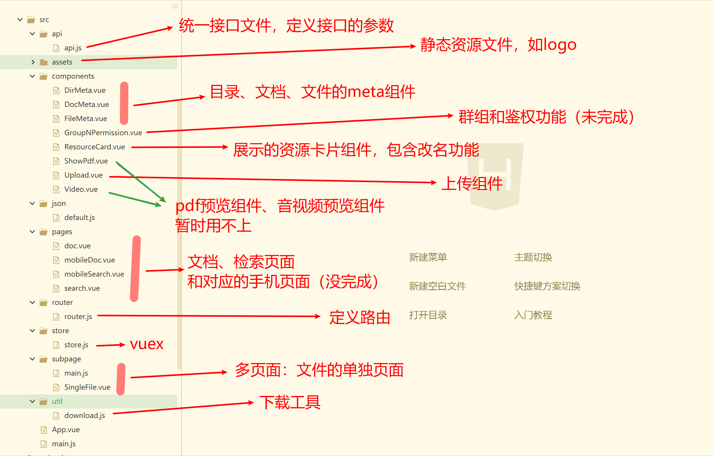

# upload

## 主要用到的东西
 - vue用于前端框架
 - [element ui](https://element.eleme.cn/#/zh-CN/component/installation)和[ant-design-vue](https://vue.ant.design/docs/vue/introduce-cn/)用于前端样式
 - [vue cli3](https://cli.vuejs.org/zh/)
 - [vue router](https://router.vuejs.org/zh/installation.html)
 - [vuex](https://vuex.vuejs.org/)


## 文件结构




## 待解决

- 未完成组件：群组鉴权、历史版本

- 看老师意思：个人信息和部门文档

- 想完成的功能：

  - [ ] 图标大小选择
  - [ ] 排列顺序选择
  - [ ] 完善权限和群组功能
  - [ ] 完善文件属性修改功能

- 不够优雅的地方：

  - [x] 点击时的过渡动画

  - [x] 点属性时的过渡动画

  - [ ] 文件文档目录图标格式单一

  - [ ] 文件排序方式单一

  - [ ] 浏览器刷新就会回到最开始的界面

  - [ ] 整体界面需要美化

    

- Debug：

  | Num  | Bug                                                          | Debug                                                        |
  | ---- | ------------------------------------------------------------ | ------------------------------------------------------------ |
  | 1    | 文档、文件删除无法取消                                       | 判断逻辑缺陷,增加判断                                        |
  | 2    | 从“个人文档”中打某个目录跳转到“文档检索”再跳回，“个人文档”的页面自动回退到个人页面 | uex增加一个值，idOfThePathJust，记录最后的目录id值，用于跳回后读取这个目录的资源列表。 |
  | 3    | 点击路径末尾，index=-1, 用函数refreshResource()刷新资源，会导致文件列表消失 | 当点击末尾的时候，不运行对应函数。                           |
  | 4    | 交互提示被阴影遮盖                                           | 更改提示弹框的层级，高于modal遮罩层                          |
  | 5    | 交互提示缺少，过于单一，不够明确，                           | 在各个操作后增加，success、warning、error不同种类提示        |
  | 6    | 删除群组的标号，退出对应界面后再次打开，还存在               | 增加退出判断语句，退出后取消显示                             |
  | 7    | 新建 不刷新问题 新建文件或文件夹 排序不正确 名字无法修改     | 新建成功立即刷新列表                                         |
  | 8    | 文件被锁定问题。提示网络有问题后，那个文件夹好像被锁定了，不能选别的文件夹，只能刷新页面。 | 取消点击限制clickReady，暂时不考虑：后端响应太慢时，出现返回数据的顺序错误 |
  | 9    | 文件的属性中时间显示错误                                     |                                                              |
  |      | 上传文件后 预览图不能同步出现                                |                                                              |
  | 11   | 一次只能打开一个文件预览。                                   |                                                              |
  | 12   | 刷新会出现一条 无字提示                                      |                                                              |
  | 13   | 登陆成功 文件不显示问题                                      |                                                              |
| 14   | 异常打开 算法.jpg                                            |                                                              |
  | 15   | 新建用户接口403 新建群组403                                  |                                                              |
  
  


## Project setup

```
npm install
```

### Compiles and hot-reloads for development
```
npm run serve
```

### Compiles and minifies for production
```
npm run build
```

### Run your tests
```
npm run test
```

### Lints and fixes files
```
npm run lint
```

### Customize configuration
See [Configuration Reference](https://cli.vuejs.org/config/).
